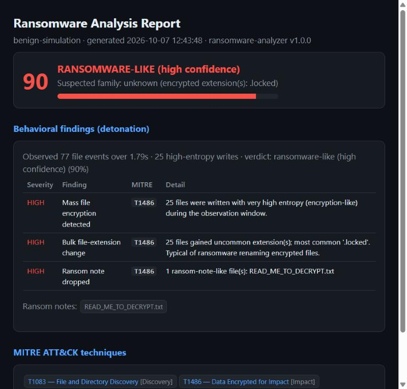
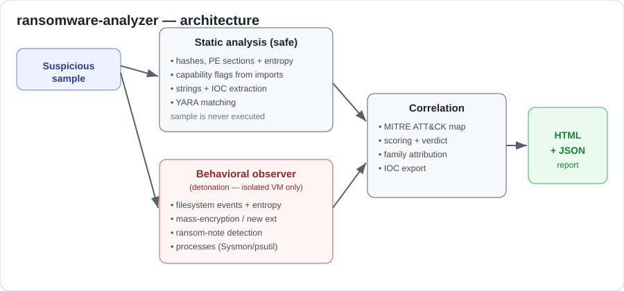
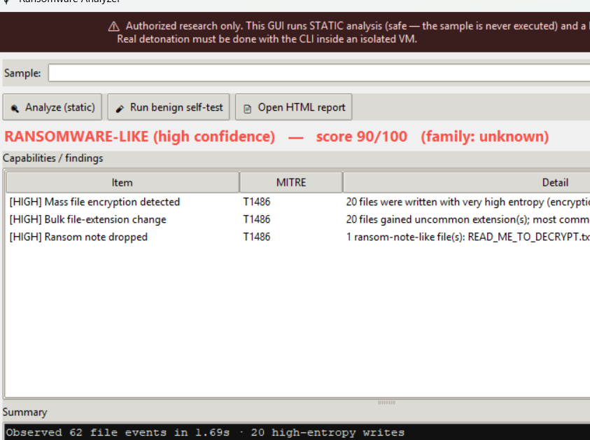

# Ransomware Analyzer

A static **and** behavioral analysis toolkit for triaging ransomware and other
Windows/Linux malware. Give it a sample and it produces a clear, structured
report: what the file is, what it can do, what it *actually did* when detonated,
which **MITRE ATT&CK** techniques it maps to, and extracted IOCs — as readable
HTML and machine-readable JSON.

> **For authorized malware research only.** This is a defensive observer/analyzer.
> It never creates, spreads, or weaponizes malware. Detonate real samples **only**
> inside an isolated VM — see [the lab-setup guide](docs/LAB_SETUP.md).



---

## Why this exists

Most people either click a cuckoo-style sandbox they don't understand, or read a
raw strings dump. This tool sits in the middle: a small, readable, hackable
pipeline that shows **how** ransomware triage works — static capability analysis,
live behavioral detonation, and ATT&CK-mapped reporting — in a few hundred lines
of well-documented Python. It is built for blue-team / DFIR learning and for fast
first-pass triage.

## Features

- **Static analysis (safe — the sample is never executed):** SHA-256/MD5/SHA-1,
  PE parsing with per-section entropy, capability flags derived from imported APIs
  (crypto, process injection, anti-debug, persistence, C2, discovery), packer
  detection, string + IOC extraction (URLs, IPs, `.onion`, BTC, emails), and
  **YARA** matching against a bundled, extendable rule set.
- **Behavioral observer (detonation, in a VM):** watches the filesystem (mass
  encryption, entropy spikes, new extensions, ransom notes), enumerates processes
  and flags suspicious command lines (`vssadmin delete shadows`, `bcdedit`, …),
  and — on Windows — can consume **Sysmon** events. Observes only; never kills or
  modifies anything.
- **Correlation + reporting:** maps everything to **MITRE ATT&CK**, computes a
  verdict and confidence score, attempts (honest) family attribution, and writes
  **HTML + JSON** reports with an IOC list.
- **User-friendly:** a clean CLI *and* a simple GUI.
- **Safe self-test:** a built-in **benign** simulator reproduces ransomware-like
  behavior inside a temp sandbox so you can see the whole pipeline work **without
  any real malware**.

## Architecture



## Screenshots

| GUI | HTML report |
|-----|-------------|
|  |  |

---

## Install

```bash
git clone https://github.com/skriptkiddy98x/ransomware-analyzer
cd ransomware-analyzer
pip install -r requirements.txt
```

Python 3.10+. A prebuilt Windows `.exe` is available on the
[Releases](../../releases) page (no Python needed).

## Usage

### CLI

```bash
# Static analysis only — safe, does not execute the sample
python rza.py static suspicious.exe --out reports

# Behavioral observer — you launch the sample yourself in the VM
python rza.py monitor --watch C:\Users\analyst\Documents --timeout 120

# Detonate AND observe — ISOLATED VM ONLY
python rza.py detonate suspicious.exe --yes-run-in-vm --timeout 120

# Benign self-test (no real malware) — great first run / demo
python rza.py simulate --out reports
```

Example static run:

```
       Static analysis
 file type   PE executable (Windows)
 entropy     7.9
 sha256      a376...fca506
 yara        Crypto_API_Usage
 mitre       T1027, T1083, T1486
```

### GUI

```bash
python rza_gui.pyw        # or run the packaged RansomwareAnalyzer.exe
```

The GUI performs **static** analysis and the **benign self-test** only; real
detonation stays in the CLI, in a VM.

Reports are written to the output directory as `<name>.html` and `<name>.json`.

---

## Safety: the isolated lab

Detonating real malware on a normal machine is dangerous. Read
**[docs/LAB_SETUP.md](docs/LAB_SETUP.md)** first. In short:

- Use a **dedicated analysis VM** (VirtualBox), with a **clean snapshot** you revert
  after every run.
- **No network, or host-only** (optionally a second VM running INetSim/FakeNet-NG as
  a fake internet). Never NAT to the live internet during detonation.
- **Disable shared folders, shared clipboard, and drag-and-drop.**
- Keep VirtualBox updated; never store sensitive data on the host; ideally use a
  dedicated machine. Malware can detect VMs (anti-VM).
- Obtain samples responsibly (e.g. MalwareBazaar, VX-Underground, theZoo) and keep
  them zipped/password-protected until inside the VM.

## MITRE ATT&CK coverage

The analyzer references techniques including **T1486** (Data Encrypted for Impact),
**T1490** (Inhibit System Recovery), **T1055** (Process Injection), **T1112**
(Modify Registry), **T1083** (File & Directory Discovery), **T1071** (C2),
**T1027** (Obfuscation), and more. Each technique in a report links to attack.mitre.org.

## Limitations (honest)

- Behavioral detection is heuristic; sophisticated or sandbox-aware samples may
  evade it or refuse to run inside a VM.
- Family attribution is best-effort and will often say **unknown** — that is by
  design rather than guessing.
- This is a learning/triage tool, not a replacement for CAPE/Cuckoo or a commercial
  sandbox.
- Static analysis is strongest on Windows PE files; other formats get hashes,
  strings, IOCs and YARA only.

## Development

```bash
pip install pytest
pytest            # runs unit + end-to-end tests using the benign simulator
```

## License & disclaimer

MIT — see [LICENSE](LICENSE). See [DISCLAIMER.md](DISCLAIMER.md). Use only on
systems and samples you are authorized to analyze.
